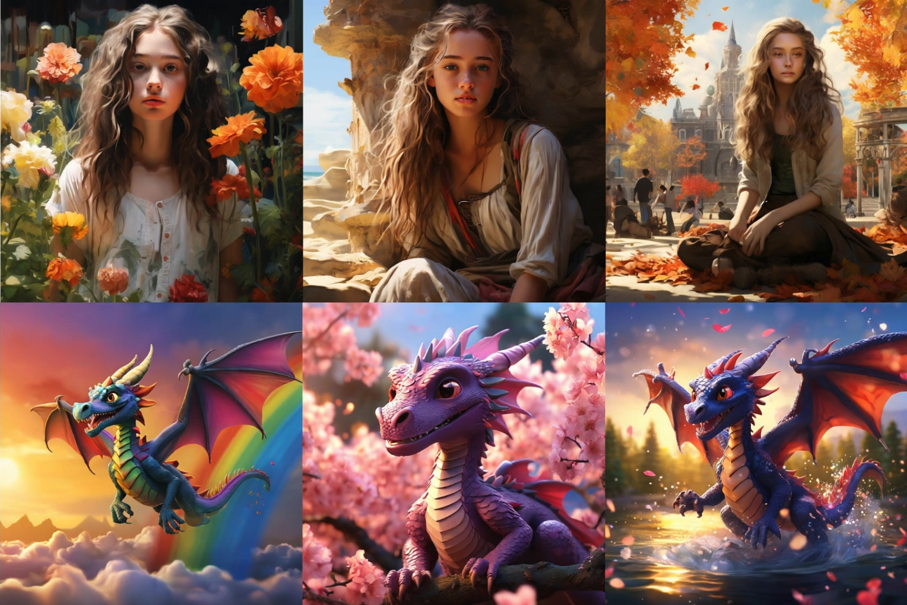
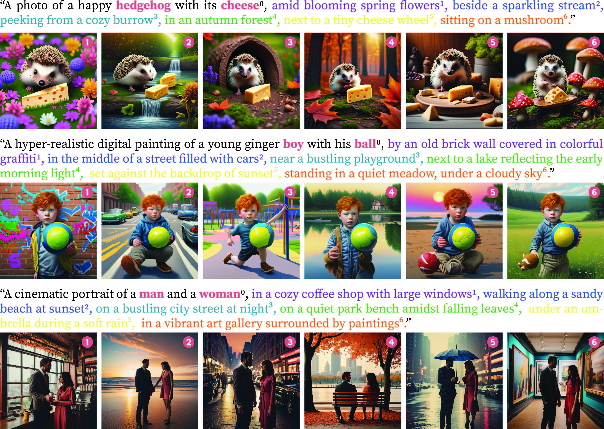
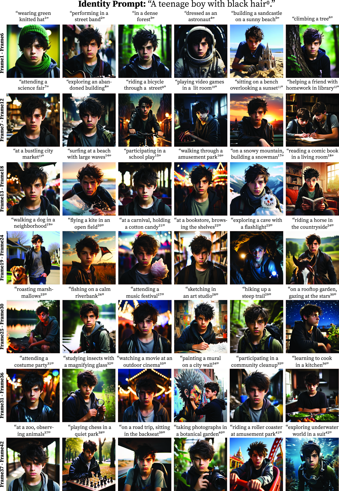

<h1 align="center">
  🔥ICLR 2025 (Spotlight) One-Prompt-One-Story: Free-Lunch Consistent Text-to-Image Generation Using a Single Prompt
  <br>
</h1>


<div align="center">

<a href="http://59.110.93.62:7089/" style="display: inline-block;">
    
</a>&nbsp;
<a href="https://arxiv.org/abs/2501.13554" style="display: inline-block;">
    
</a>&nbsp;
<a href="https://byliutao.github.io/1Prompt1Story.github.io/" style="display: inline-block;">
    
</a>&nbsp;

</div>


<p align="center">
  <a href="#key-features">Key Features</a> •
  <a href="#how-to-use">How To Use</a> •
  <a href="#license">License</a> •
  <a href="#citation">Citation</a> •
  <a href="#visualization">Visualization</a> 
</p>

[](./resource/demo.png)

## Key Features

* Consistent Image Generation Code: main.py
* Gradio Code: app.py 
* Benchmark Generation Code: resource/gen_benchmark.py
* Consistory+ Benchmark: [link](./resource/consistory+.yaml)
* Online Gradio demo: [link](http://59.110.93.62:7089/)
* 🚩[Chinese Version Paper (new)](https://www.overleaf.com/read/pxyhqpsccfjk#20922a)
* 🚩[Jittor Version (new)](https://github.com/byliutao/1Prompt1Story/tree/main/jittor_version)


## How To Use

```bash
# Clone this repository
$ git clone https://github.com/byliutao/1Prompt1Story

# Go into the repository
$ cd 1Prompt1Story

### Install dependencies ###
$ conda create --name 1p1s python=3.10
$ conda activate 1p1s
# choose the right cuda version of your device
$ conda install pytorch torchvision torchaudio pytorch-cuda=12.1 -c pytorch -c nvidia 
$ pip install transformers==4.46.3  # or: conda install conda-forge::transformers 
$ conda install -c conda-forge diffusers
$ pip install opencv-python scipy gradio==4.44.1 sympy==1.13.1
### Install dependencies ENDs ###

# Run infer code
$ python main.py

# Run gradio code
$ python app.py

# Run benchmark generation code
$ python -m resource.gen_benchmark --save_dir ./result/benchmark --benchmark_path ./resource/consistory+.yaml
```

## License
This project is licensed under the MIT License - see the [LICENSE](LICENSE) file for details.


## Citation
If our work assists your research, feel free to give us a star ⭐ or cite us using:
```
@inproceedings{
liu2025onepromptonestory,
title={One-Prompt-One-Story: Free-Lunch Consistent Text-to-Image Generation Using a Single Prompt},
author={Tao Liu and Kai Wang and Senmao Li and Joost van de Weijer and Fhad Khan and Shiqi Yang and Yaxing Wang and Jian Yang and Mingming Cheng},
booktitle={The Thirteenth International Conference on Learning Representations},
year={2025},
url={https://openreview.net/forum?id=cD1kl2QKv1}
}
```

## Visualization

### Multi-Subject Generation
  <figure style="display: inline-block; margin: 20px; text-align: center; max-width: 700px;">
    
  </figure>

### Comparison with Other Models
  <figure style="display: inline-block; margin: 20px; text-align: center; max-width: 700px;">
    
  </figure>

### Long Story Image Generation
<div align="center">
  <figure style="display: inline-block; margin: 20px; text-align: center; max-width: 700px;">
    
  </figure>


