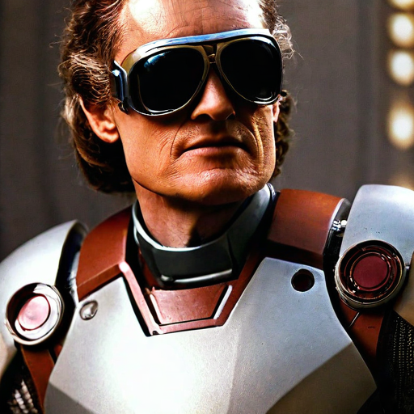

<p align="center">
  

</p>

<!-- ## <div align="center"><b>PhotoMaker</b></div> -->

<div align="center">
  
## PhotoMaker: Customizing Realistic Human Photos via Stacked ID Embedding  [](https://huggingface.co/papers/2312.04461)
[[Paper](https://huggingface.co/papers/2312.04461)] &emsp; [[Project Page](https://photo-maker.github.io)] &emsp; [[Model Card](https://huggingface.co/TencentARC/PhotoMaker)] <br>

[[🤗 Demo (Realistic)](https://huggingface.co/spaces/TencentARC/PhotoMaker)] &emsp; [[🤗 Demo (Stylization)](https://huggingface.co/spaces/TencentARC/PhotoMaker-Style)] <br>

[[Replicate Demo (Realistic)](https://replicate.com/jd7h/photomaker)] &emsp; [[Replicate Demo (Stylization)](https://replicate.com/yorickvp/photomaker-style)] <be>

</div>


---
[Jittor](https://github.com/Jittor/jittor) implementation of **[PhotoMaker: Customizing Realistic Human Photos via Stacked ID Embedding](https://huggingface.co/papers/2312.04461)**.


### 🌠  **Key Feature:**

Experience the **Jittor** version of Photomaker just like the original PyTorch version, but with even greater speed and convenience.

---

<div align="center">


</div>


## 🚩 **TODO/Updates**
- [x] Realistic generation 
- [ ] Stylization generation

---

## 🔥 **Examples**


### Realistic generation 


- [**PhotoMaker notebook demo**](photomaker_demo.ipynb)

<p align="center">
  
</p>

<p align="center">
  
</p>

We can see that whether it’s generating an Iron Man Newton image with Photomaker or creating a multi-color style image of Scarlett Johansson, the Jittor version **delivers the same quality** as the PyTorch version. Both versions produce images that are *imaginative and diverse*. 

Additionally, the Jittor version offers **enhanced performance**, making the image generation process faster and more efficient. This improvement allows users to create stunning visuals with greater ease and speed, without compromising on the **artistic creativity and variety** that Photomaker is known for.

### Stylization generation 

Stylization generation is currently unavailable due to compatibility issues with Jittor. We will address this in a future update.


# 🔧 Dependencies and Installation

- Python = 3.9 (Recommend to use [Anaconda](https://www.anaconda.com/download/#linux) or [Miniconda](https://docs.conda.io/en/latest/miniconda.html))
- JDiffusion: 
```bash
conda create --name photomaker python=3.9
conda activate photomaker

# Install requirements
pip install -r requirements.txt

# Install photomaker
cd example/photomaker
pip install -e .

```

Then you can run the following command to use it
```python
from photomaker import PhotoMakerStableDiffusionXLPipeline
```

# ⏬ Download Models 
The model will be automatically downloaded through the following two lines:

```python
from huggingface_hub import hf_hub_download
photomaker_path = hf_hub_download(repo_id="TencentARC/PhotoMaker", filename="photomaker-v1.bin", repo_type="model")
```

You can also choose to download manually from this [url](https://huggingface.co/TencentARC/PhotoMaker).

# 💻 How to Test

## Use like [diffusers](https://github.com/huggingface/diffusers)

- Dependency
```py
import torch
import os
from diffusers.utils import load_image
from diffusers import EulerDiscreteScheduler
from photomaker import PhotoMakerStableDiffusionXLPipeline

### Load base model
pipe = PhotoMakerStableDiffusionXLPipeline.from_pretrained(
    base_model_path,  # can change to any base model based on SDXL
    torch_dtype=torch.bfloat16, 
    use_safetensors=True, 
    variant="fp16"
).to(device)

### Load PhotoMaker checkpoint
pipe.load_photomaker_adapter(
    os.path.dirname(photomaker_path),
    subfolder="",
    weight_name=os.path.basename(photomaker_path),
    trigger_word="img"  # define the trigger word
)     

pipe.scheduler = EulerDiscreteScheduler.from_config(pipe.scheduler.config)

### Also can cooperate with other LoRA modules
# pipe.load_lora_weights(os.path.dirname(lora_path), weight_name=lora_model_name, adapter_name="xl_more_art-full")
# pipe.set_adapters(["photomaker", "xl_more_art-full"], adapter_weights=[1.0, 0.5])

pipe.fuse_lora()
```

- Input ID Images
```py
### define the input ID images
input_folder_name = './examples/newton_man'
image_basename_list = os.listdir(input_folder_name)
image_path_list = sorted([os.path.join(input_folder_name, basename) for basename in image_basename_list])

input_id_images = []
for image_path in image_path_list:
    input_id_images.append(load_image(image_path))
```

- Generation
```py
# Note that the trigger word `img` must follow the class word for personalization
prompt = "a half-body portrait of a man img wearing the sunglasses in Iron man suit, best quality"
negative_prompt = "(asymmetry, worst quality, low quality, illustration, 3d, 2d, painting, cartoons, sketch), open mouth, grayscale"
generator = torch.Generator(device=device).manual_seed(42)
images = pipe(
    prompt=prompt,
    input_id_images=input_id_images,
    negative_prompt=negative_prompt,
    num_images_per_prompt=1,
    num_inference_steps=num_steps,
    start_merge_step=10,
    generator=generator,
).images[0]
gen_images.save('out_photomaker.png')
```


<p align="center">
  
</p>


## Start a local gradio demo
Run the following command:

```python
python gradio_demo/app.py
```

You could customize this script in [this file](gradio_demo/app.py).

If you want to run it on MAC, you should follow [this Instruction](MacGPUEnv.md) and then run the app.py.

## Usage Tips:
- Upload more photos of the person to be customized to improve ID fidelity. If the input is Asian face(s), maybe consider adding 'Asian' before the class word, e.g., `Asian woman img`
- When stylizing, does the generated face look too realistic? Adjust the Style strength to 30-50, the larger the number, the less ID fidelity, but the stylization ability will be better. You could also try out other base models or LoRAs with good stylization effects.
- Reduce the number of generated images and sampling steps for faster speed. However, please keep in mind that reducing the sampling steps may compromise the ID fidelity.


# 🤗 Acknowledgements
- PhotoMaker is co-hosted by Tencent ARC Lab and Nankai University [MCG-NKU](https://mmcheng.net/cmm/).
- Inspired from many excellent demos and repos, including [IP-Adapter](https://github.com/tencent-ailab/IP-Adapter), [multimodalart/Ip-Adapter-FaceID](https://huggingface.co/spaces/multimodalart/Ip-Adapter-FaceID), [FastComposer](https://github.com/mit-han-lab/fastcomposer), and [T2I-Adapter](https://github.com/TencentARC/T2I-Adapter). Thanks for their great work!
- Thanks to the Venus team in Tencent PCG for their feedback and suggestions.
- Thanks to the HuggingFace team for their generous support! 

# Disclaimer
This project strives to impact the domain of AI-driven image generation positively. Users are granted the freedom to create images using this tool, but they are expected to comply with local laws and utilize it responsibly. The developers do not assume any responsibility for potential misuse by users.

# BibTeX
If you find PhotoMaker useful for your research and applications, please cite using this BibTeX:

```BibTeX
@inproceedings{li2023photomaker,
  title={PhotoMaker: Customizing Realistic Human Photos via Stacked ID Embedding},
  author={Li, Zhen and Cao, Mingdeng and Wang, Xintao and Qi, Zhongang and Cheng, Ming-Ming and Shan, Ying},
  booktitle={IEEE Conference on Computer Vision and Pattern Recognition (CVPR)},
  year={2024}
}
